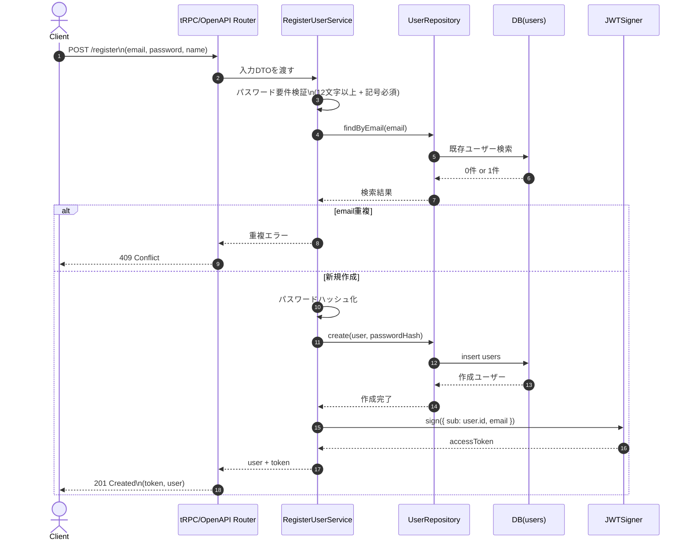

## Plan: Hono JWTユーザー新規登録（DRAFT）

`tRPC` と `OpenAPI` の両方に「ユーザー新規登録」を追加し、登録成功時に `JWT`（`HS256` / `SECRET`環境変数 / `7d`）を返す方針で進めます。既存のオニオンアーキテクチャに合わせ、`domain -> service -> infrastructure -> controller` の責務分離を維持しつつ、`packages/shared` に入出力スキーマを追加して `.input(...)` / `.output(...)` に寄せます。`users` テーブルは既存の [packages/db/src/schema/users.ts](packages/db/src/schema/users.ts) を利用し、`email` 重複・パスワード要件（12文字+記号）をユースケースで検証、`password_hash` で保存、成功時に JWT 発行までを MVP 範囲とします。

**Steps**
1. 要件定数と共通仕様を定義する（`JWT_EXPIRES_IN=7d`、パスワード最小長/記号要件、重複時エラー方針）を [apps/backend/src/services](apps/backend/src/services) 配下の users 用モジュールに集約。
2. 共有入出力スキーマを追加する: [packages/shared/src/schema](packages/shared/src/schema) に users 用 `input/output` を新設し、[packages/shared/src/index.ts](packages/shared/src/index.ts) で公開（`registerUserInputSchema` / `registerUserOutputSchema`）。
3. ドメイン層を追加する: [apps/backend/src/domain/entities](apps/backend/src/domain/entities) に `User` エンティティ、[apps/backend/src/domain/repositories](apps/backend/src/domain/repositories) に `UserRepository` インターフェース、重複メール等のドメイン/ユースケースエラー型を定義。
4. インフラ実装を追加する: [apps/backend/src/infrastructre/repositories](apps/backend/src/infrastructre/repositories) に `Drizzle` ベース `UserRepository` 実装を追加し、[packages/db/src/schema/users.ts](packages/db/src/schema/users.ts) を参照して `findByEmail` / `create` を実装。
5. ユースケースを追加する: [apps/backend/src/services/users](apps/backend/src/services/users) に `register-user.service.ts` を追加し、パスワード検証→ハッシュ化→保存→JWT発行を実施（router にはロジックを置かない）。
6. DI を接続する: [apps/backend/src/services/di/tokens.ts](apps/backend/src/services/di/tokens.ts) と [apps/backend/src/infrastructre/di/container.ts](apps/backend/src/infrastructre/di/container.ts) に `UserRepository` と `RegisterUserService` を登録。
7. `tRPC` エンドポイントを追加する: [apps/backend/src/controller/routers](apps/backend/src/controller/routers) に `user.router.ts` を追加し、`.input(registerUserInputSchema)` / `.output(registerUserOutputSchema)` を適用、[apps/backend/src/controller/routers/index.ts](apps/backend/src/controller/routers/index.ts) に統合。
8. `OpenAPI` エンドポイントを追加する: [apps/backend/src/controller/routers/openapi](apps/backend/src/controller/routers/openapi) に users 用 route を追加し、[apps/backend/src/controller/routers/openapi/index.ts](apps/backend/src/controller/routers/openapi/index.ts) へ接続（公開APIとして認証不要）。
9. JWT 検証基盤を最小導入する: [apps/backend/src/index.ts](apps/backend/src/index.ts) または controller 層の共通ミドルウェアに `hono/jwt` 検証を追加し、登録以外の保護対象に順次適用できる形にする。
10. テストを追加する: 既存パターンに合わせ [apps/backend/src/services/users](apps/backend/src/services/users) のユースケーステストと [apps/backend/src/controller/routers](apps/backend/src/controller/routers) / [apps/backend/src/controller/routers/openapi](apps/backend/src/controller/routers/openapi) の登録APIテスト（正常系/異常系）を整備。

**Verification**
- `pnpm --filter @account-book/backend test`
- `pnpm --filter @account-book/shared test`
- 登録API（tRPC/OpenAPI）で「成功時JWT返却」「重複email」「弱いパスワード」を確認。
- 保護APIで `Authorization: Bearer <token>` の検証が通ることを最小確認。

**Decisions**
- 経路: `tRPC` + `OpenAPI` の両方で提供。
- 登録応答: JWT を返す（自動ログイン）。
- JWT: `HS256` + `SECRET` 環境変数 + `7d`。
- パスワード: 12文字以上 + 記号必須を MVP に含める。

## シーケンス図（Markdown記述案・DRAFT）

保存先候補: [docs/user-register-jwt-sequence.md](docs/user-register-jwt-sequence.md)

